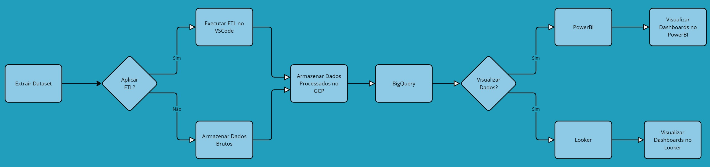

# Método Pagamento No Brasil

O Método de Pagamento no Brasil fornece estatísticas mensais detalhadas sobre transações financeiras no país em suas diversas formas. Este projeto visa analisar os dados do Banco Central do Brasil para compreender a evolução dos métodos de pagamento.

## Visão Geral do Projeto
- Objetivo: Analisar os métodos de pagamento no Brasil, com foco especial nas transações via PIX.
- Tecnologias Utilizadas: Python, Jupyter Notebook, Google Cloud Platform (GCP), BigQuery, Looker.
- Fontes de Dados: Banco Central do Brasil, arquivos CSV e Excel.

## Arquitetura do Projeto

O fluxo de dados segue a metodologia ETL (Extract, Transform, Load), conforme ilustrado:

## 1. Extração dos Dados

**Objetivo**: Coletar dados brutos de diferentes fontes.
Principais atividades:
- Obtenção de dados do Banco Central do Brasil.
- Leitura de arquivos CSV e Excel com informações de transações financeiras.
- Uso do Python (Pandas, Requests, BeautifulSoup) para acessar APIs e web scraping (se necessário).

## 2. Transformação dos Dados

**Objetivo**: Limpar, organizar e preparar os dados para análise.
Principais atividades:

- Limpeza de dados: remoção de valores nulos e duplicados.
- Padronização: ajuste de formatos de data, valores monetários e categorias.
- riação de novas colunas para análises avançadas (ex: cálculo de ticket médio).
- Enriquecimento de dados: cruzamento com outras bases para insights adicionais.
- Uso de Jupyter Notebook e Pandas para manipulação e visualização inicial.

## 3. Carga dos Dados

**Objetivo**: Armazenar os dados transformados em um ambiente otimizado para consultas.
Principais atividades:

- Envio dos dados para o Google Cloud Storage (GCS).
- Carregamento dos dados no BigQuery para processamento analítico.
- Organização em tabelas otimizadas para consultas eficientes.

## 4. Refinamento e Análise

**Objetivo**: Extrair insights valiosos sobre os métodos de pagamento.
Principais atividades:

- Consultas SQL no BigQuery para análise de padrões de pagamento.
- Análises estatísticas para entender o comportamento do PIX ao longo do tempo.
- Comparação entre diferentes estados, períodos e valores transacionados.

## 5. Visualização

**Objetivo**: Apresentar os dados de forma clara e interativa.
Principais atividades:

- Construção de dashboards interativos no Looker e Google Data Studio.
- Criação de gráficos para mostrar:
  - Volume total de transações PIX.
  - Comparação mensal/anual de pagamentos.
  - Tendências e insights estratégicos.
 
## Fluxo de Processamento:

Extração de Dados: Coleta do dataset bruto. Processamento ETL: Caso necessário, os dados passam por um processo de transformação via VSCode. 
Armazenamento: Dados brutos ou processados são armazenados no Google Cloud Platform (GCP). 
Os dados estruturados são carregados no BigQuery para análise.
 Visualização:
Os dados podem ser analisados através de Power BI ou Looker, permitindo a criação de dashboards interativos.
 Tecnologias Utilizadas:
 VSCode: Processamento e transformação dos dados
 Google Cloud Platform (GCP): Armazenamento de dados
 BigQuery: Consulta e análise de dados
 Power BI e Looker: Visualização e criação de dashboards
Esse fluxo garante um pipeline de dados eficiente e escalável para análise dos métodos de pagamento.
